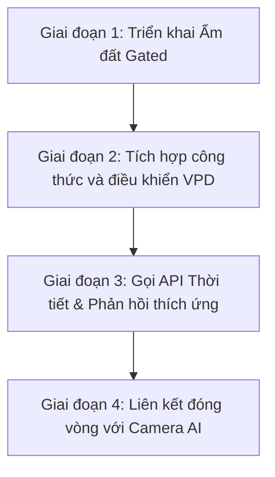

# ĐỀ XUẤT NÂNG CẤP HỆ THỐNG TỰ ĐỘNG HÓA THÔNG MINH (SMART AUTOMATION PROPOSAL)

Tài liệu này đề xuất định hướng nâng cấp hệ thống tự động hóa của **PlantBot** từ việc điều khiển dựa trên lịch trình tĩnh (Static Scheduling) sang điều khiển thích ứng thông minh (Adaptive & Closed-Loop Control), tích hợp các chỉ số sinh học cây trồng và dữ liệu môi trường dự báo để tối ưu hóa năng suất gieo trồng cải thìa.

---

## 1. Bối Cảnh & Vấn Đề Hiện Tại

Mặc dù hệ thống tự động hóa hiện tại hoạt động ổn định và có các chốt an toàn vật lý (Failsafe) rất tốt, giao thức tự động hóa vẫn tồn tại một số điểm hạn chế:
1.  **Chưa có vòng phản hồi độ ẩm đất (Open-Loop Watering):** Hệ thống tưới gốc theo giờ chẵn cố định, bất kể độ ẩm đất thực tế là bao nhiêu. Điều này dẫn đến nguy cơ thừa nước khi trời nồm ẩm hoặc thiếu nước vào những ngày hanh khô cực đoan.
2.  **Thiếu chỉ số sinh học không khí thực tế (VPD):** Việc điều khiển phun sương chỉ dựa trên độ ẩm tương đối ($RH$). Trong thực tế sinh học, khả năng quang hợp và trao đổi chất của lá cây phụ thuộc vào **Áp suất hơi nước thiếu hụt (VPD)** - sự kết hợp chặt chẽ giữa cả nhiệt độ và độ ẩm tương đối.
3.  **Hệ thống bị động trước thời tiết bên ngoài:** Hệ thống chỉ phản ứng khi các thông số cảm biến trong buồng trồng thay đổi vượt ngưỡng, chưa có khả năng "tiên đoán" để chuẩn bị trước cho các điều kiện bất lợi (ví dụ: nắng nóng đỉnh điểm vào trưa mai).

---

## 2. Các Hạng Mục Đề Xuất Nâng Cấp

> [!TIP]
> Các nâng cấp dưới đây được thiết kế theo dạng module độc lập, có thể triển khai cuốn chiếu từng phần mà không gây gián đoạn hệ thống hiện tại.

### Hạng Mục 1: Tưới nước thông minh theo phản hồi độ ẩm đất (Soil Moisture-Gated Watering)
Thay đổi cơ chế kích hoạt máy bơm nước gốc từ lịch trình thời gian thuần túy sang cơ chế lai (Hybrid Control):
*   **Tưới khi cần thiết (Demand-driven):** Kích hoạt tưới ngay lập tức nếu độ ẩm đất tụt xuống dưới ngưỡng tối thiểu cho phép (Ví dụ: $< 45\%$) và tự động tắt bơm khi độ ẩm đất chạm ngưỡng no nước (Ví dụ: $75\%$).
*   **Bỏ qua chu kỳ thừa (Smart Gating):** Đến mốc giờ tưới theo lịch trình (ví dụ: 12:00), backend sẽ đọc cảm biến đất. Nếu độ ẩm đất đang $> 70\%$ (do trời âm u, bốc hơi nước chậm), hệ thống sẽ **bỏ qua (Skip)** lượt tưới đó hoặc giảm thời lượng tưới xuống $50\%$.

| Trạng thái ẩm đất | Điều kiện giờ tưới | Hành động của máy bơm |
| :--- | :--- | :--- |
| **Ẩm đất < 45%** (Khô hạn) | Bất kỳ lúc nào | Bơm cứu nạn ngay lập tức trong 15s (kèm 5m cooldown) |
| **Ẩm đất 45% - 70%** | Đúng giờ hẹn của Giai đoạn | Bơm theo thời gian định mức (có nhân hệ số ML Optimizer) |
| **Ẩm đất > 70%** | Đúng giờ hẹn của Giai đoạn | Bỏ qua lượt tưới (Skip) để phòng úng rễ |

---

### Hạng Mục 2: Điều hòa không khí theo chỉ số sinh học VPD (Vapor Pressure Deficit)
Thay thế cơ chế điều khiển phun sương và quạt gió độc lập bằng thuật toán kiểm soát VPD thời gian thực.
*   **Công thức tính chỉ số VPD ($kPa$):**
    $$VP_{sat} = 0.61078 \times e^{\left(\frac{17.27 \times Temp}{Temp + 237.3}\right)}$$
    $$VPD = VP_{sat} \times \left(1 - \frac{Humidity}{100}\right)$$
    *(Trong đó: $Temp$ là nhiệt độ $^\circ\text{C}$, $Humidity$ là độ ẩm tương đối $\%$).*
*   **Mục tiêu điều khiển:** Điều chỉnh phun sương và quạt thông gió để đưa chỉ số VPD vào **dải tối ưu cho cải thìa ($0.8 - 1.2\text{ kPa}$)**.
    *   Nếu $VPD > 1.2\text{ kPa}$ (Không khí quá khô, cây thoát hơi nước quá nhanh gây héo lá): Kích hoạt phun sương để giảm VPD.
    *   Nếu $VPD < 0.8\text{ kPa}$ (Không khí quá ẩm, cây không thể thoát hơi nước để hút dinh dưỡng): Bật quạt thông gió để giảm độ ẩm khí và tăng VPD lên dải an toàn.

---

### Hạng Mục 3: Tích hợp API dự báo thời tiết (Weather API Integration)
Backend FastAPI tích hợp cuộc gọi định kỳ (ví dụ mỗi 3 tiếng) đến API thời tiết (như OpenWeatherMap) dựa trên vị trí địa lý của trạm trồng.
*   **Hành động dự phòng chủ động (Proactive Control):**
    *   Nếu dự báo ngày mai có nắng nóng cực đoan ($> 38^\circ\text{C}$): Hệ thống tự động tưới đẫm đất hơn vào ban đêm để tích trữ nhiệt dung ẩm, đồng thời chuẩn bị chạy quạt thông gió sớm hơn chu kỳ bình thường 1 tiếng.
    *   Nếu dự báo trời mưa nồm độ ẩm cao: Giảm tần suất phun sương giữ ẩm và chuẩn bị chạy quạt thông gió tăng cường.

---

### Hạng Mục 4: Thích ứng khép kín qua phản hồi từ Camera AI
Tạo vòng lặp khép kín (Closed-Loop) giữa dịch vụ phân tích hình ảnh AI và dịch vụ tự động hóa:
*   **Tự động phản hồi bệnh:**
    *   Khi Camera AI phân tích ảnh và phát hiện dấu hiệu **nấm mốc ẩm ướt** trên bề mặt lá cải thìa: Gửi tín hiệu giảm ngay $20\%$ độ ẩm mục tiêu (hạ trần phun sương) và tăng thời gian chạy quạt thông gió thêm $30\%$.
    *   Khi AI phát hiện dấu hiệu **lá bị rủ, thiếu nước**: Tự kích hoạt chu kỳ tưới bù ẩm gốc.

---

## 3. Lợi Ích Dự Kiến

1.  **Tăng năng suất cây trồng:** Cây luôn trong trạng thái thoát hơi nước và hấp thụ dinh dưỡng lý tưởng nhờ kiểm soát VPD, rút ngắn thời gian thu hoạch cải thìa từ 35 ngày xuống còn khoảng 30 - 32 ngày.
2.  **Tiết kiệm tài nguyên:** Giảm lượng nước tưới dư thừa, giảm thời gian hoạt động vô ích của máy bơm và máy phun sương, kéo dài tuổi thọ thiết bị.
3.  **Phòng ngừa dịch bệnh chủ động:** Khống chế tuyệt đối hiện tượng ngập úng rễ và đọng sương trên lá - hai tác nhân chính gây ra nấm mốc và thối nhũn ở cải thìa.

---

## 4. Lộ Trình Triển Khai Đề Xuất

*   **Tuần 1 (Giai đoạn 1):** Cập nhật logic `automation.py` để check độ ẩm đất thực tế từ sensor trước khi quyết định gửi lệnh `PUMP_ON`.
*   **Tuần 2 (Giai đoạn 2):** Viết module tính toán VPD ở backend, cấu hình lại dải bật/tắt thiết bị dựa trên VPD thay cho RH.
*   **Tuần 3 (Giai đoạn 3):** Đăng ký API thời tiết miễn phí và viết tác vụ nền (background task) cập nhật dự báo thời tiết vào hệ thống.
*   **Tuần 4 (Giai đoạn 4):** Xây dựng cầu nối API giữa AI Camera Service và Automation Service để hoàn thành chu trình tự động hóa khép kín hoàn toàn.
