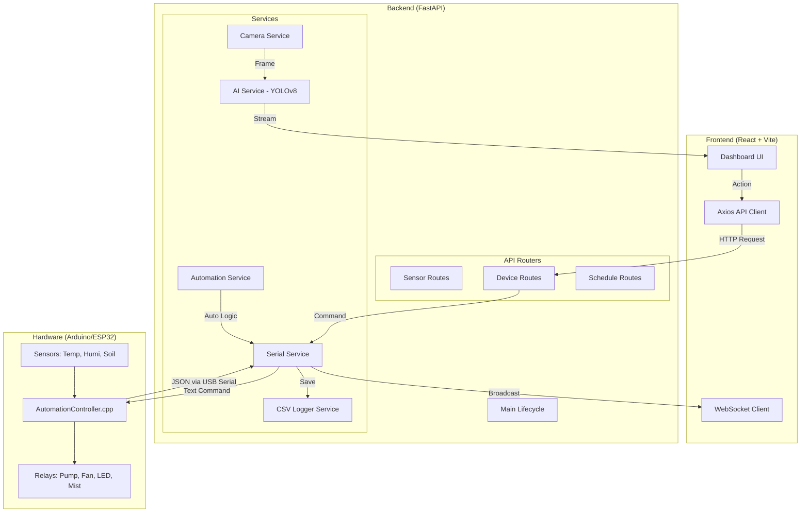

# 🌿 Kiến Trúc Hệ Thống PlantBot

Tài liệu này mô tả chi tiết luồng hoạt động của hệ thống PlantBot, từ cảm biến phần cứng đến giao diện người dùng và trí tuệ nhân tạo.

---

## 1. Sơ đồ Kiến trúc Tổng thể

---

## 2. Luồng Dữ liệu & Điều khiển

### A. Dữ liệu Cảm biến (Real-time)
*   **Arduino:** Đọc dữ liệu mỗi 2 giây và gửi chuỗi JSON qua Serial.
*   **Backend:** Parse JSON, lưu vào `sensor_data.csv` và broadcast qua WebSocket.
*   **Frontend:** Cập nhật biểu đồ và trạng thái thiết bị tức thời.

### B. Điều khiển Thiết bị (Hybrid Model)
Hệ thống vận hành theo mô hình ưu tiên:
1.  **Lệnh Thủ công:** Người dùng nhấn nút trên Web UI -> Gửi lệnh trực tiếp xuống Arduino.
2.  **Lệnh Tự động (PC):** `AutomationService` tính toán dựa trên lịch trình và giai đoạn tăng trưởng để gửi lệnh.
3.  **Failsafe (Arduino):** Khi mất kết nối PC, Arduino tự chạy logic cơ bản để duy trì sự sống cho cây.

---

## 3. Cấu trúc Thư mục Dự án

| Thư mục | Chức năng chính |
| :--- | :--- |
| `firmware/` | Mã nguồn C++ cho Arduino, điều khiển Relay và Failsafe logic. |
| `backend/` | Xử lý Serial, API, Logic tự động hóa và AI Service. |
| `frontend/` | Dashboard giao diện người dùng (React). |
| `ai_module/` | Model YOLOv8 và dữ liệu huấn luyện nhận diện bệnh. |
| `data/` | Lưu trữ ảnh bệnh và log dữ liệu cảm biến (CSV). |
| `documents/` | Tài liệu hướng dẫn và quy trình vận hành. |

---
*Cập nhật: 11/06/2026*
