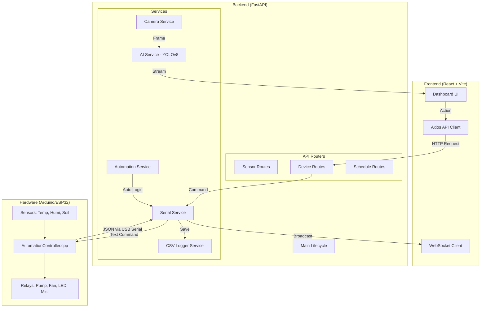
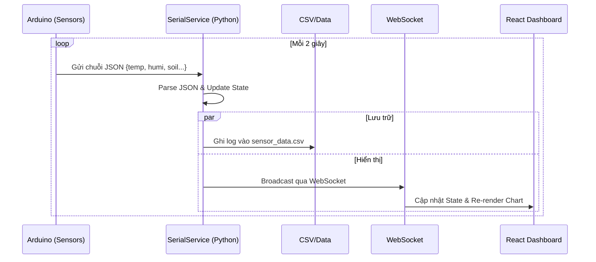
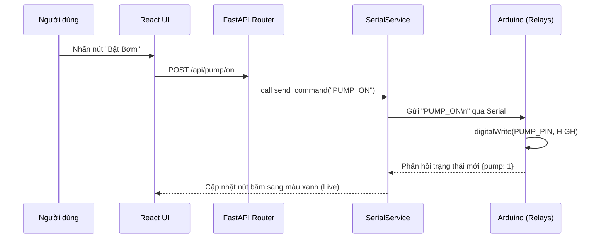
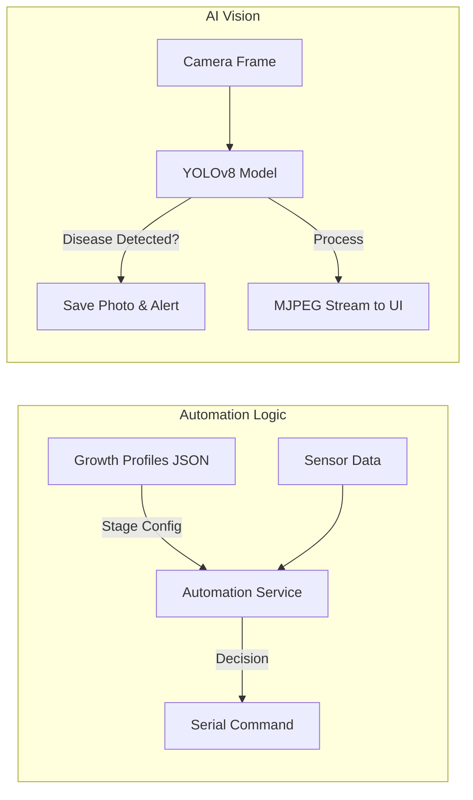

# 🌿 PlantBot Project: Visual Workflow & Architecture

Tài liệu này mô tả chi tiết luồng hoạt động của hệ thống PlantBot, từ cảm biến phần cứng đến giao diện người dùng và trí tuệ nhân tạo.

---

## 1. Kiến trúc Tổng thể (System Architecture)

---

## 2. Luồng Dữ liệu Cảm biến (Sensor Data Flow)
*Luồng này đảm bảo dữ liệu từ vườn cây được hiển thị real-time trên Dashboard.*

---

## 3. Luồng Điều khiển Thiết bị (Device Control Flow)
*Luồng khi người dùng thao tác thủ công trên giao diện.*

---

## 4. Luồng Tự động hóa & AI (Automation & AI Flow)
*Sự kết hợp giữa Logic tăng trưởng và Thị giác máy tính.*

---

## 5. Cấu trúc Thư mục & Chức năng

| Thư mục | Chức năng chính |
| :--- | :--- |
| `firmware/` | Mã nguồn C++ cho Arduino, điều khiển trực tiếp Relay và đọc cảm biến. |
| `backend/app/services/` | "Trái tim" của hệ thống, xử lý Serial, AI, và Logic tự động hóa. |
| `backend/app/api/` | Các cổng kết nối (Endpoints) để Frontend giao tiếp với Backend. |
| `frontend/src/` | Giao diện người dùng, biểu đồ và các nút điều khiển. |
| `ai_module/` | Chứa model YOLOv8 (`.pt`) và các notebook huấn luyện. |
| `data/` | Nơi lưu trữ ảnh bệnh và file log CSV. |

---
*Tài liệu được tạo tự động bởi PlantBot Assistant - 2026*
